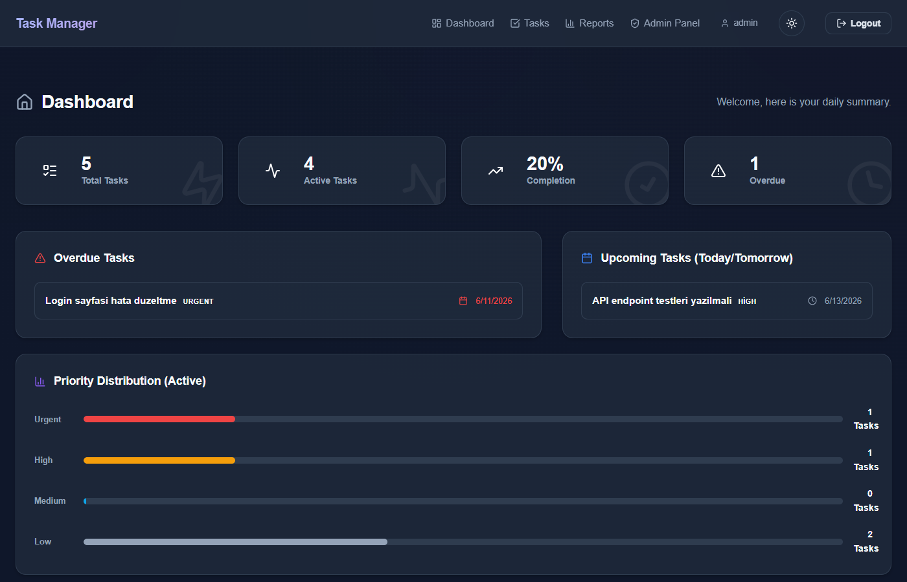
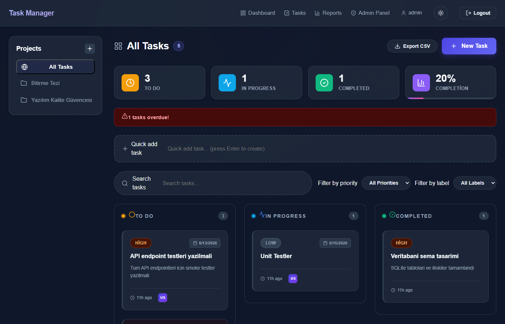
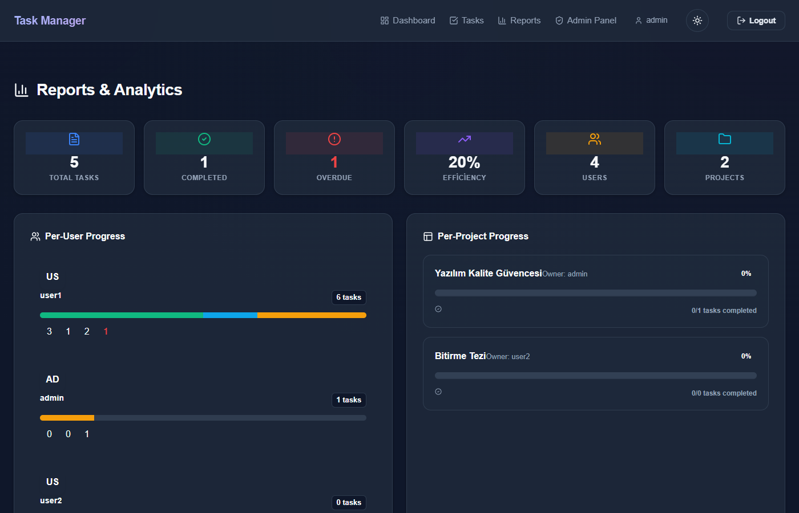

# Term Project - Task Manager API

## Project Description

This project is a task management (Task Manager) REST API application developed as part of the Software Quality Assurance course. Built using TypeScript, Node.js, and the Express framework, this API allows users to create, update, list, and delete tasks. It provides a fully functional backend service including authentication and authorization mechanisms.

## Screenshots

<div align="center">
  
  <br/><br/>
  
  <br/><br/>
  
</div>

## Architecture Overview

The application is designed according to layered architecture principles. The presentation layer contains HTTP endpoints defined with Express Routers, while business logic is located in separate service modules under the `services/` directory. This approach significantly facilitates code testability and maintainability.

At the database layer, synchronous SQLite operations are performed using the `better-sqlite3` library. The `db.ts` module automatically creates tables when the application starts, and performance is optimized by enabling WAL (Write-Ahead Logging) mode. Foreign key constraints are also explicitly activated.

Authentication is provided through server-side session management via the `express-session` middleware. The session ID is stored in an `httpOnly` cookie, protecting against XSS attacks. User passwords are hashed with `bcrypt` before being stored in the database, strengthening security.

The test infrastructure is built on Vitest and Supertest. Unit tests test service functions with isolated in-memory databases, while smoke tests send real HTTP requests to verify the end-to-end flow. This two-layer test strategy guarantees that both individual components and the system as a whole work correctly.

## Installation and Running

### Prerequisites

- Node.js >= 18.x
- npm >= 9.x

### Steps

```bash
# Install dependencies
npm install

# Seed the database with initial data
npm run seed

# Start in development mode
npm run dev

# Build for production
npm run build

# Run the compiled application
npm start
```

## Default Users (Seed)

After running the `npm run seed` command, the following users are created:

| Username | Password  | Role  |
|----------|-----------|-------|
| admin    | Admin123! | admin |
| user1    | User123!  | user  |

Seed also creates 3 sample tasks: one with "todo", one with "in-progress", and one with "done" status.

## Session Management Choice

Server-side `express-session` was chosen over JWT for session management. The primary reason for this decision is security-focused: since session data is stored on the server, invalidating a session (e.g., forcing a user to log out) is possible instantly. With a JWT-based approach, invalidation is not possible until the token expires. The session ID is carried in an `httpOnly` cookie, preventing JavaScript access, thereby providing additional protection against XSS attacks.

## Database Choice

SQLite (`better-sqlite3`) was chosen as the database. This choice allows the application to run independently (without requiring an additional database server) and eliminates setup complexity, especially in development environments. Since the `better-sqlite3` library provides a synchronous API, code readability is improved and async/await complexity is avoided. WAL mode is enabled to improve concurrent read performance.

## Test Commands

```bash
# Run all tests
npm test

# Run only smoke tests
npm run test:smoke

# Run only unit tests
npm run test:unit
```

## Test Logs

`npm test` output (98/98 tests passed):

```
  ✓ tests/smoke/api.smoke.test.ts (31)
  ✓ tests/unit/taskService.test.ts (24)
  ✓ tests/unit/reportService.test.ts (8)
  ✓ tests/unit/labelService.test.ts (9)
  ✓ tests/unit/commentService.test.ts (8)
  ✓ tests/unit/projectService.test.ts (7)
  ✓ tests/unit/authService.test.ts (10)

 Test Files  7 passed (7)
      Tests  98 passed (98)
   Start at  14:50:04
   Duration  1.30s (transform 189ms, setup 1ms, collect 594ms, tests 420ms, environment 0ms, prepare 131ms)
```

## Tests

Two fundamental test levels have been implemented as part of quality assurance in this project: Unit Tests and Smoke Tests.

### Smoke Tests

Smoke tests verify whether the application's most critical functions work correctly end-to-end. The 31 scenarios in `tests/smoke/api.smoke.test.ts` cover:

1.  **Authentication:** Registration, login, and session cookie verification.
2.  **Authorization:** Blocking access to protected endpoints without logging in and admin-only endpoint tests.
3.  **Core Entity (Task) CRUD:** Task creation, listing, detail viewing, updating, and deletion flows.
4.  **Validation:** Rejection of requests with invalid data (e.g., empty title) with 400 error.
5.  **Additional Features:** Comment add/delete, label management, subtask creation, and project-based management.
6.  **Reporting:** Authorized access to statistics and summary reports.

### Unit Tests

Unit tests test business rules and data validation logic in the service layer in isolation without database or network dependencies (with in-memory DB). A total of 67 unit tests include the following topics:

-   **Validation / Business Rules:** Input validation functions (empty value, length, format checking) in `taskService`, `authService`, `labelService`, etc.
-   **Authorization Decision:** Role-based (admin/user) access permissions in `authService`.
-   **Error Cases:** Resource not found (404), unauthorized access (403), and conflict situations managed at the service level.
-   **Service Logic:** CRUD interactions of the core entity and auxiliary entities (label, comment, project) with the database, and complex statistics calculation algorithms (`reportService`).

## API Endpoint Documentation

### Authentication

| Method | Endpoint            | Description              | Access       |
|--------|---------------------|--------------------------|--------------|
| POST   | /api/auth/register  | Register new user        | Public       |
| POST   | /api/auth/login     | Login, create session    | Public       |
| POST   | /api/auth/logout    | End session              | Logged in    |
| GET    | /api/auth/me        | Current session info     | Logged in    |

#### POST /api/auth/register
```json
{
  "username": "johndoe",
  "email": "john@example.com",
  "password": "Pass123!"
}
```

#### POST /api/auth/login
```json
{
  "username": "johndoe",
  "password": "Pass123!"
}
```

### Tasks

All task endpoints require authentication.

| Method | Endpoint         | Description          | Access       |
|--------|------------------|----------------------|--------------|
| GET    | /api/tasks       | List all tasks       | Logged in    |
| POST   | /api/tasks       | Create new task      | Logged in    |
| GET    | /api/tasks/:id   | Get single task      | Logged in    |
| PATCH  | /api/tasks/:id   | Update task          | Logged in    |
| DELETE | /api/tasks/:id   | Delete task          | Logged in    |

#### POST /api/tasks — Create Task
```json
{
  "title": "Task title",
  "description": "Optional description",
  "status": "todo"
}
```
Valid `status` values: `todo`, `in-progress`, `done`

#### PATCH /api/tasks/:id — Update Task
```json
{
  "title": "New title",
  "status": "in-progress"
}
```

### Admin

Only users with the `admin` role can access.

| Method | Endpoint          | Description                    | Access |
|--------|-------------------|--------------------------------|--------|
| GET    | /api/admin/users  | List all users                 | Admin  |
| GET    | /api/admin/stats  | User and task statistics       | Admin  |

### System

| Method | Endpoint  | Description          |
|--------|-----------|----------------------|
| GET    | /health   | Service health check |

## Error Responses

For validation errors:
```json
{
  "errors": [
    { "field": "title", "message": "Title is required" }
  ]
}
```

For general errors:
```json
{
  "error": "Error message"
}
```

## HTTP Status Codes

| Code | Description                              |
|------|------------------------------------------|
| 200  | Success                                  |
| 201  | Resource created                         |
| 204  | Success, no content (deletion)           |
| 400  | Invalid request / validation error       |
| 401  | Authentication required                  |
| 403  | Unauthorized access                      |
| 404  | Resource not found                       |
| 409  | Conflict (username/email already exists) |
| 500  | Server error                             |

## Optional UI (BONUS)

A user interface developed with React + Vite is located in the `client/` directory.

### UI Setup and Running

```bash
cd client
npm install
npm run dev
```

Open http://localhost:5173 in your browser. The backend (port 3000) must be running.

### UI Features
- Login and registration pages
- Task list: create, edit, delete
- Status badges (To Do / In Progress / Completed)
- Admin panel: user list and statistics (admin role only)
